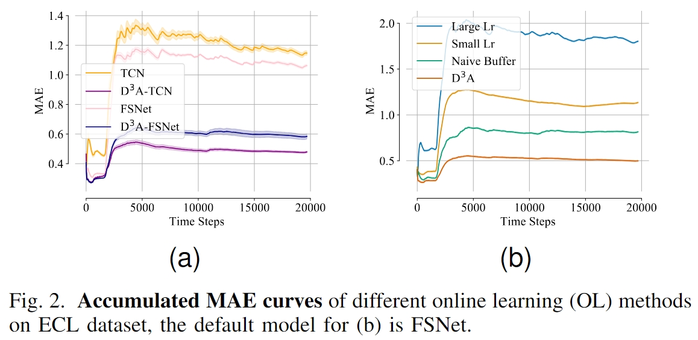

# (NeurIPS 2023) OneNet: Enhancing Time Series Forecasting Models under Concept Drift by Online Ensembling

This codebase is the official implementation of [`OneNet: Enhancing Time Series Forecasting Models under Concept Drift by Online Ensembling`](https://arxiv.org/abs/2309.12659) (**NeurIPS 2023**) and [`Addressing Concept Shift in Online Time Series Forecasting: Detect-then-Adapt`](https://arxiv.org/abs/2403.14949)


## 🔥 Update
* [2023-09-22]: ⭐️ Paper online. Check out [Detect-then-Adapt](https://arxiv.org/abs/2403.14949) for details.
* [2023-09-22]: ⭐️ Paper online. Check out [OneNet](https://arxiv.org/abs/2403.05262) for details.
* [2023-09-20]: 🚀🚀 Codes released.


## Introduction for OneNet

Online updating of time series forecasting models aims to address the **concept drifting problem** by efficiently updating forecasting models based on streaming data. Many algorithms are designed for online time series forecasting, with some exploiting **cross-variable dependency** while others assume **independence among variables**. Given every data assumption has its own pros and cons in online time series modeling, we propose **On**line **e**nsembling **Net**work (**OneNet**). It dynamically updates and combines two models, with one focusing on modeling the dependency across the time dimension and the other on cross-variate dependency. Our method incorporates a reinforcement learning-based approach into the traditional online convex programming framework, allowing for the linear combination of the two models with dynamically adjusted weights. **OneNet** addresses the main shortcomings of classical online learning methods that tend to be slow in adapting to the concept drift. Empirical results show that OneNet reduces online forecasting error by more than $50$% compared to the State-Of-The-Art (SOTA) method.


1) The proposed OneNet-TCN (online ensembling of TCN and Time-TCN) surpasses most of the competing baselines across various forecasting horizons;
2) If the combined branches are stronger, for example, OneNet combined FSNet and Time-FSNet, achieving much better performance than OneNet-TCN. Namely, OneNet can integrate any advanced online forecasting methods or representation learning structures to enhance the robustness of the model.
3) The average MSE and MAE of OneNet are significantly better than using either branch (FSNet or Time-TCN) alone, which underscores the significance of incorporating online ensembling. 
4) OneNet achieves faster and better convergence than other methods;

## Introduction for Detect-then-Adapt
While numerous algorithms have been developed, most of them focus on model design and updating. In practice, many of these methods struggle with continuous performance regression in the face of accumulated concept drifts over time. We first detects drifting conception and then aggressively adapts the current model to the drifted concepts after the detection for rapid adaption. Our empirical studies across six datasets demonstrate the effectiveness of  in improving model adaptation capability. Notably, compared to a simple Temporal Convolutional Network (TCN) baseline, $D^3A$ reduces the average Mean Squared Error (MSE) by $43.9$%. For the state-of-the-art (SOTA) model, the MSE is reduced by $33.3$%.



1) **Introduce a Concept Detection Framework:** Our framework monitors loss distribution drift, aiming to predict the occurrence of concept drift. This detector provides instructions for our model updating, enhancing model robustness and AI safety, particularly in high-risk tasks.

2) **More realistic Evaluation setting:** We observe that previous benchmarks often presume a substantial overlap in the forecasting target during testing. In this paper, we advocate for the evaluation of online time series forecasting models with delayed feedback, demonstrating a more realistic and challenging assessment.

3) **Strong Empirical Studies:** With 6 datasets, D3A improves model adaptation capability across various methods. For example, compared to a simple TCN baseline, D3A reduces the average MSE by $43.9%$ and MAE by $26.9%$. For the previous SOTA model FSNet, the reductions in MSE and MAE are $33.3%$ and $16.7%$, respectively. In a more challenging real-world experimental setting, D3A consistently outperforms existing methods. For TCN, FSNet, and OneNet, the MSE reductions are $32%$, $33.1%$, and $22.2%$, respectively.

## Requirements

- python == 3.7.3
- pytorch == 1.8.0
- matplotlib == 3.1.1
- numpy == 1.19.4
- pandas == 0.25.1
- scikit_learn == 0.21.3
- tqdm == 4.62.3
- einops == 0.4.0

## Benchmarking

### 1. Data preparation

We follow the same data formatting as the Informer repo (https://github.com/zhouhaoyi/Informer2020), which also hosts the raw data.
Please put all raw data (csv) files in the ```./data``` folder.

### 2. Run experiments

To replicate our results on the ETT, ECL, Traffic, and WTH datasets, run
```
sh run.sh
```


To replicate our results of $D^3A$, run
```
sh run_d3a.sh
```

### 3.  Arguments

You can specify one of the above method via the ```--method``` argument.

**Dataset:** Our implementation currently supports the following datasets: Electricity Transformer - ETT (including ETTh1, ETTh2, ETTm1, and ETTm2), ECL, Traffic, and WTH. You can specify the dataset via the ```--data``` argument.

**Other arguments:** Other useful arguments for experiments are:
- ```--test_bsz```: batch size used for testing: must be set to **1** for online learning,
- ```--seq_len```: look-back windows' length, set to **60** by default,
- ```--pred_len```: forecast windows' length, set to **1** for online learning.


**D3A Arguments:**
Here are additional arguments useful for experiments:

- `--sleep_interval`: Corresponds to \( l_w \) in our paper, representing the window size for the drift detector.
- `--sleep_epochs`: Determines the number of epochs the model should be fully fine-tuned when a drift is detected. It is set to **20** by default.
- `--online_adjust`: After detecting a drift, the regularization weight \( \lambda \) in our paper is set to **0.5** by default.
- `--offline_adjust`: During each step, the algorithm samples previous data and augments it for regularization. The regularization weight is set to **0.5** by default.
- `--alpha_d`: Represents a predefined confidence level for triggering concept drift, set to **0.003** by default.

### 4.  Baselines

**Backbones:** Our implementation supports the following backbones in Table.1:

- patch: PatchTST for online time series forecasting
- fedformer: FedFormer for online time series forecasting
- dlinear: DLinear for online time series forecasting
- cross_former: Crossformer for online time series forecasting
- naive_time: The proposed Time-TCN for online time series forecasting
- naive_time: The proposed Time-TCN for online time series forecasting


**Ablations:** Our online learning and ensembling ablation baselines in Table.4:
- fsnet_plus_time: Simple averaging
- onenet_gate: Gating mechanism
- onenet_linear_regression: Linear Regression (LR)
- onenet_egd: Exponentiated Gradient Descent (EGD)
- onenet_weight: Reinforcement learning to learn the weight directly (RL-W)

**Algorithms:** Our implementation supports the following training strategies in Table.2,3:
- ogd: OGD training
- large: OGD training with a large backbone
- er: experience replay
- derpp: dark experience replay
- nomem: FSNET without the associative memory
- naive: FSNET without both the memory and adapter, directly trains the adaptation coefficients.
- fsnet: FSNet framework
- fsnet_d3a: FSNet with Detect-then-Adapt framework
- fsnet_time: Cross-Time FSNet
- onenet_minus: the proposed OneNet- in section 4
- onenet_tcn: the proposed OneNet with tcn backbone
- onenet_fsnet: the proposed OneNet 
- onenet_d3a: the proposed OneNet with Detect-then-Adapt framework


### 5.  Baselines

## License

This source code is released under the MIT license, included [here](LICENSE).

### Citation 
If you find this repo useful, please consider citing: 
```
@inproceedings{
    zhang2023onenet,
    title={OneNet: Enhancing Time Series Forecasting Models under Concept Drift by Online Ensembling},
    author={YiFan Zhang and Qingsong Wen and Xue Wang and Weiqi Chen and Liang Sun and Zhang Zhang and Liang Wang and Rong Jin and Tieniu Tan},
    booktitle={Thirty-seventh Conference on Neural Information Processing Systems},
    year={2023}
}

@misc{zhang2024addressing,
      title={Addressing Concept Shift in Online Time Series Forecasting: Detect-then-Adapt}, 
      author={YiFan Zhang and Weiqi Chen and Zhaoyang Zhu and Dalin Qin and Liang Sun and Xue Wang and Qingsong Wen and Zhang Zhang and Liang Wang and Rong Jin},
      year={2024},
      eprint={2403.14949},
      archivePrefix={arXiv},
      primaryClass={cs.LG}
}
```
