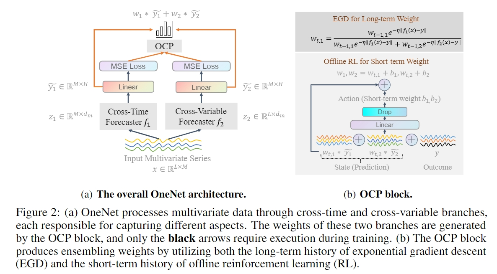
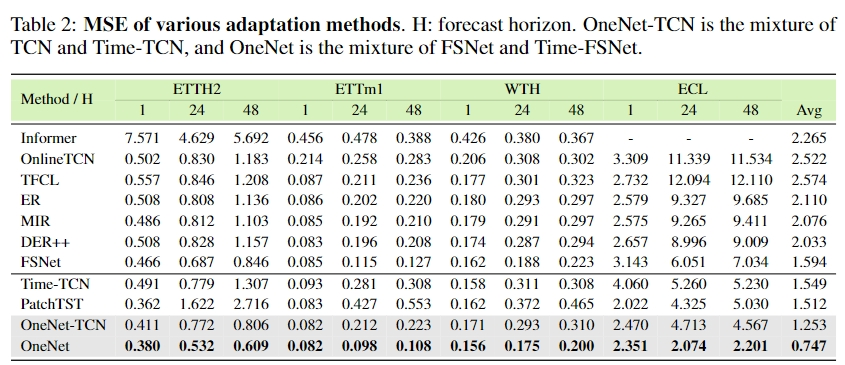

# OneNet: Enhancing Time Series Forecasting Models under Concept Drift by Online Ensembling

This codebase is the official implementation of [`OneNet: Enhancing Time Series Forecasting Models under Concept Drift by Online Ensembling`](https://arxiv.org/abs/2309.12659) (**NeurIPS 2023 poster**)


This codebase is mainly based on [FSNet](https://github.com/salesforce/fsnet).
## Introduction

Online updating of time series forecasting models aims to address the **concept drifting problem** by efficiently updating forecasting models based on streaming data. Many algorithms are designed for online time series forecasting, with some exploiting **cross-variable dependency** while others assume **independence among variables**. Given every data assumption has its own pros and cons in online time series modeling, we propose **On**line **e**nsembling **Net**work (**OneNet**). It dynamically updates and combines two models, with one focusing on modeling the dependency across the time dimension and the other on cross-variate dependency. Our method incorporates a reinforcement learning-based approach into the traditional online convex programming framework, allowing for the linear combination of the two models with dynamically adjusted weights. **OneNet** addresses the main shortcoming of classical online learning methods that tend to be slow in adapting to the concept drift. Empirical results show that \abbr reduces online forecasting error by more than $50$% compared to the State-Of-The-Art (SOTA) method.





## Requirements

- python == 3.7.3
- pytorch == 1.8.0
- matplotlib == 3.1.1
- numpy == 1.19.4
- pandas == 0.25.1
- scikit_learn == 0.21.3
- tqdm == 4.62.3
- einops == 0.4.0

## Benchmarking

### 1. Data preparation

We follow the same data formatting as the Informer repo (https://github.com/zhouhaoyi/Informer2020), which also hosts the raw data.
Please put all raw data (csv) files in the ```./data``` folder.

### 2. Run experiments

To replicate our results on the ETT, ECL, Traffic, and WTH datasets, run
```
sh run.sh
```

### 3.  Arguments


You can specify one of the above method via the ```--method``` argument.

**Dataset:** Our implementation currently supports the following datasets: Electricity Transformer - ETT (including ETTh1, ETTh2, ETTm1, and ETTm2), ECL, Traffic, and WTH. You can specify the dataset via the ```--data``` argument.

**Other arguments:** Other useful arguments for experiments are:
- ```--test_bsz```: batch size used for testing: must be set to **1** for online learning,
- ```--seq_len```: look-back windows' length, set to **60** by default,
- ```--pred_len```: forecast windows' length, set to **1** for online learning.

### 4.  Baselines

**Backbones:** Our implementation supports the following backbones in Table.1:

- patch: PatchTST for online time series forecasting
- fedformer: FedFormer for online time series forecasting
- dlinear: DLinear for online time series forecasting
- cross_former: Crossformer for online time series forecasting
- naive_time: The proposed Time-TCN for online time series forecasting
- naive_time: The proposed Time-TCN for online time series forecasting


**Ablations:** Our online learning and ensembling ablation baselines in Table.4:
- fsnet_plus_time: Simple averaging
- onenet_gate: Gating mechanism
- onenet_linear_regression: Linear Regression (LR)
- onenet_egd: Exponentiated Gradient Descent (EGD)
- onenet_weight: Reinforcement learning to learn the weight directly (RL-W)

**Algorithms:** Our implementation supports the following training strategies in Table.2,3:
- ogd: OGD training
- large: OGD training with a large backbone
- er: experience replay
- derpp: dark experience replay
- nomem: FSNET without the associative memory
- naive: FSNET without both the memory and adapter, directly trains the adaptation coefficients.
- fsnet: FSNet framework
- fsnet_time: Cross-Time FSNet
- onenet_minus: the proposed OneNet- in section 4
- onenet_tcn: the proposed OneNet with tcn backbone
- onenet_fsnet: the proposed OneNet 

## License

This source code is released under the MIT license, included [here](LICENSE).

### Citation 
If you find this repo useful, please consider citing: 
```
@misc{zhang2023onenet,
      title={OneNet: Enhancing Time Series Forecasting Models under Concept Drift by Online Ensembling}, 
      author={Yi-Fan Zhang and Qingsong Wen and Xue Wang and Weiqi Chen and Liang Sun and Zhang Zhang and Liang Wang and Rong Jin and Tieniu Tan},
      year={2023},
      eprint={2309.12659},
      archivePrefix={arXiv},
      primaryClass={cs.LG}
}
```
